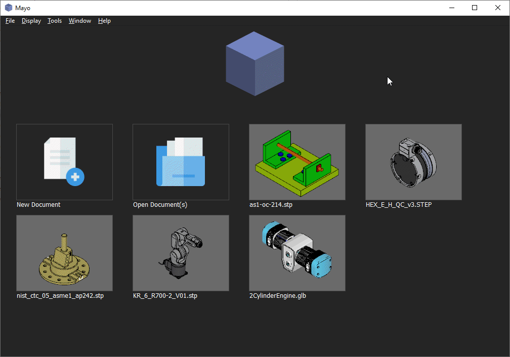
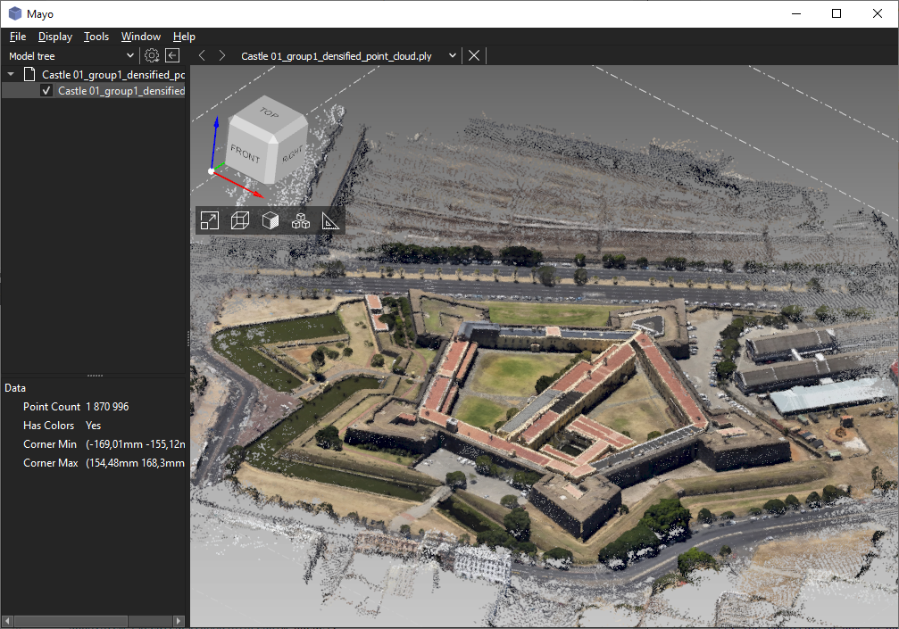

<div align="center">
  
[](https://github.com/fougue/mayo/actions/workflows/ci_windows.yml)
[](https://github.com/fougue/mayo/actions/workflows/ci_linux.yml)
[](https://github.com/fougue/mayo/actions/workflows/ci_macos.yml)
[](https://app.codacy.com/gh/fougue/mayo/dashboard?utm_source=gh&utm_medium=referral&utm_content=&utm_campaign=Badge_grade)
[](https://github.com/fougue/mayo/releases)
[](https://github.com/fougue/mayo/releases)
  
</div>

<div align="center">
  
  <p></p>
  <p align="center"><strong>Mayo</strong> the opensource 3D CAD viewer and converter</9>
  <p></p>
  
</div>

## :eyeglasses: Overview
- **Convert 3D files** <br/>
Mayo can read/write 3D files from/to STEP, IGES, STL and many other [CAD formats](https://github.com/fougue/mayo/wiki/Supported-formats)

- **Visualize 3D files** <br/>
Mayo 3D viewer supports clip planes, exploding of assemblies, measurement of shapes, show/hide parts, ...

- **Cross platform** <br/>
Mayo runs on Windows, Linux and macOS

- **Solid foundations** <br/>
Mayo is developed in modern C++ with [Qt](https://www.qt.io) and [OpenCascade](https://dev.opencascade.org)

For more details have a look at this fine review [Introducing Mayo](https://librearts.org/2023/01/introducing-mayo-free-cad-files-viewer) by Libre Arts<br/>
There's also a complete [video](https://www.youtube.com/watch?v=qg6IamnlfxE&ab_channel=LibreArts) on YouTube


## :zap: Features
- **3D clip planes** with configurable capping

- **3D exploding of the model tree** allowing better exploration of complex designs

- **3D measure tools** for circles, angles, lengths, areas, bounding box, ...

- **3D view cube** providing intuitive camera manipulation

- **Quick access to CAD files** recently open thanks to thumbnails in the [Home page](https://github.com/fougue/mayo/blob/develop/doc/screenshot_5.png)

- **Toggle item visibility** within the Model tree(use checkbox)

- **Customizable mesh precision** for BREP shapes, affecting visualization quality and conversion into mesh formats

- **Convert files** to multiple CAD formats from [command-line interface](https://github.com/fougue/mayo/blob/develop/doc/screencast_cli.gif):computer:

## :floppy_disk: Supported formats
  Format  |  Import            |  Export            | Notes
----------|--------------------|--------------------|------------------
STEP      | :white_check_mark: | :white_check_mark: | AP203, 214, 242
IGES      | :white_check_mark: | :white_check_mark: | v5.3
BREP      | :white_check_mark: | :white_check_mark: | OpenCascade format
DXF       | :white_check_mark: | :x:                |
OBJ       | :white_check_mark: | :white_check_mark: |
glTF      | :white_check_mark: | :white_check_mark: | 1.0, 2.0 and GLB
VRML      | :white_check_mark: | :white_check_mark: | v2.0 UTF8
STL       | :white_check_mark: | :white_check_mark: | ASCII/binary
AMF       | :white_check_mark: | :white_check_mark: | v1.2 Text/ZIP(export)
PLY       | :white_check_mark: | :white_check_mark: | ASCII/binary
OFF       | :white_check_mark: | :white_check_mark: |
3MF       | :white_check_mark: | :x:                |
3DS       | :white_check_mark: | :x:                |
FBX       | :white_check_mark: | :x:                | 
Collada   | :white_check_mark: | :x:                |
X3D       | :white_check_mark: | :x:                |
X(DirectX)| :white_check_mark: | :x:                |
Image     | :x:                | :white_check_mark: | PNG, JPEG, ...

See also this dedicated [wikipage](https://github.com/fougue/mayo/wiki/Supported-formats) for more details

## :mag: 3D viewer operations

  Operation    |  Mouse/Keyboard controls
---------------|--------------------------
Rotate         | mouseLeft  + move
Pan            | mouseRight + move
Zoom           | mouseLeft  + mouseRight + move
Zoom +/-       | mouseWheel(scroll)
Window zoom    | CTRL + mouseLeft + move
Instant zoom   | spaceBar
Select Object  | mouseLeft click
Select Objects | SHIFT + mouseLeft clicks

Mayo supports also multiple 3D viewer navigation styles to mimic common CAD applications(CATIA, SOLIDWORKS, ...)

## :package: Install
Release packages are available for Windows and Linux on the [Releases](https://github.com/fougue/mayo/releases) page.  

Alternatives for Windows:
- [Winget](https://winstall.app/apps/Fougue.Mayo)
````
winget install --id Fougue.Mayo
````  
- [Scoop](https://scoop.sh/#/apps?s=0&d=1&o=true&q=mayo)
````
scoop bucket add extras
scoop install extras/mayo
````

## :hammer: How to build
[Instructions for Windows](https://github.com/fougue/mayo/wiki/Build-instructions-for-Windows)  
[Instructions for Linux](https://github.com/fougue/mayo/wiki/Build-instructions-for-Linux)  
[Instructions for macOS](https://github.com/fougue/mayo/wiki/Build-instructions-for-macOS)

## :clapper: Gallery

_Easy to use command-line utility for batch conversion of CAD files_
 

_Import of glTF file with textures_


_Import of STEP file with many parts_


_Import of PLY file defining point cloud_


_Options dialog with import/export configuration per CAD format_


_Home page with quick access to recent files_

