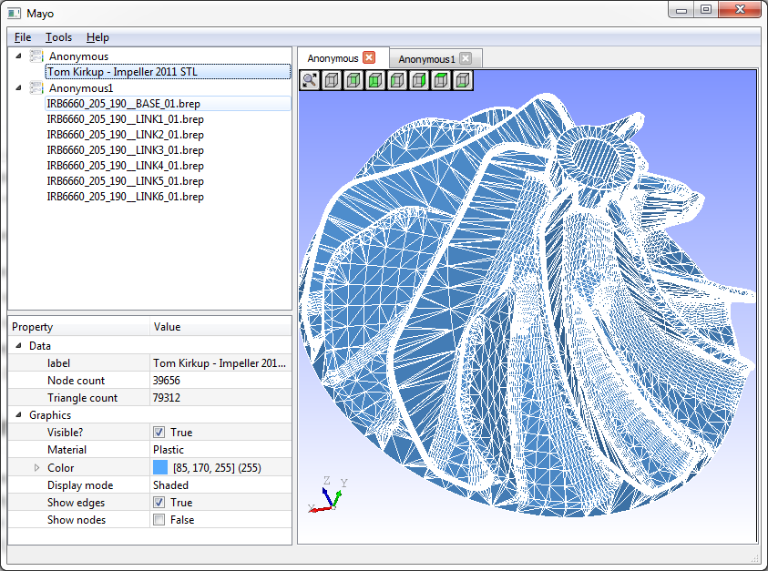
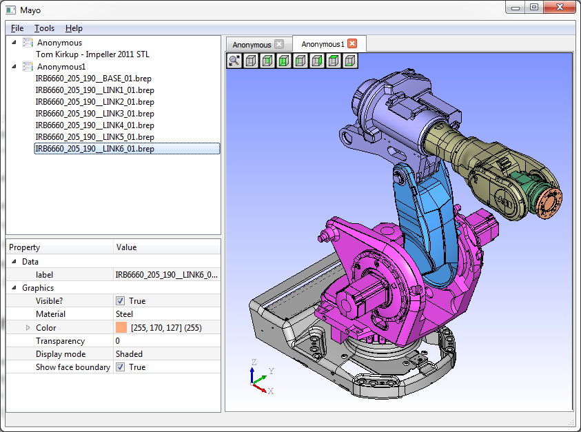

# Mayo
Mayo is a basic 3D viewer inspired by FreeCad.  
Its primary goal is to visualize CAD files imported/exported
with the [gmio](https://github.com/fougue/gmio) library.  
Mayo is a C++ project based on OpenCascade and Qt5.

Current features are :
* Multi-documents support, user can open many parts in the session
* Support of IGES/STEP/BRep formats for import/export operations
* Support of STL format with either [gmio](https://github.com/fougue/gmio) or OpenCascade(see the speed performance of gmio!)
* Save image(snapshot) of the current 3D view
* Editable 3D properties of the imported items, eg. material, color, display mode, ...

# Build instructions
Mayo requires Qt5 and OpenCascade-7.0.0.  
Although only tested with VC++/Windows it should build fine on Linux and MacOS.  
`cd .../mayo`  
`qmake "GMIO_ROOT=path_to_gmio" "CASCADE_ROOT=path_to_opencascade"`  
`(n)make`

# Screenshots

