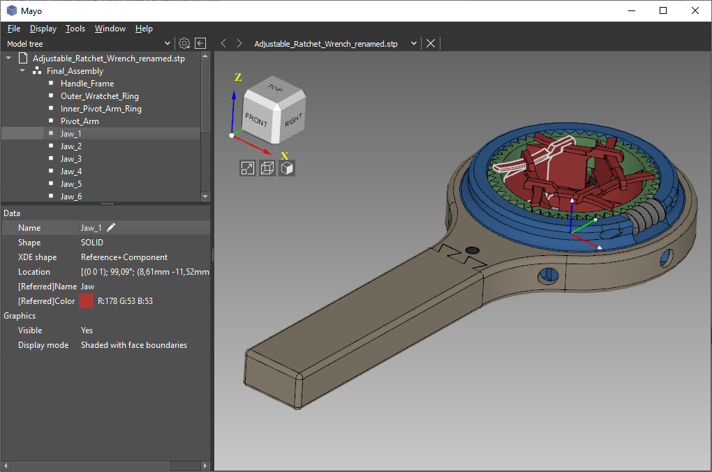
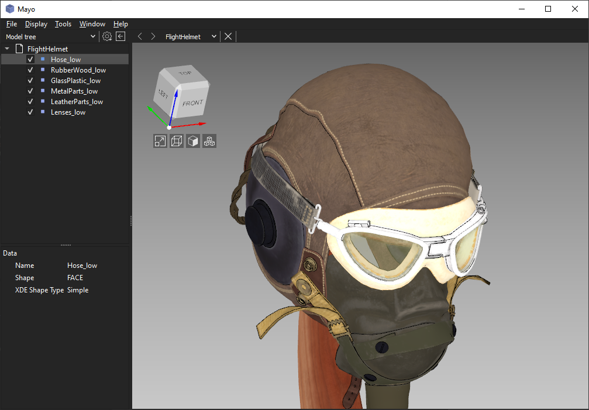
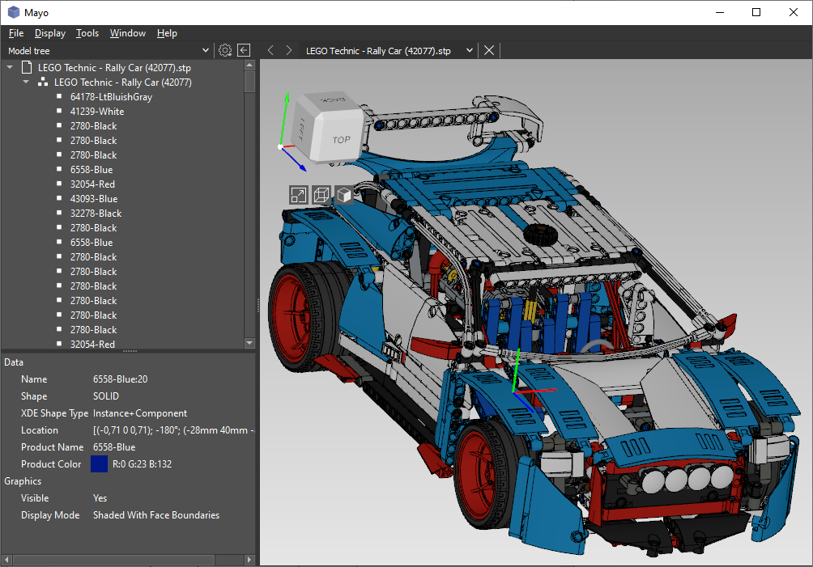
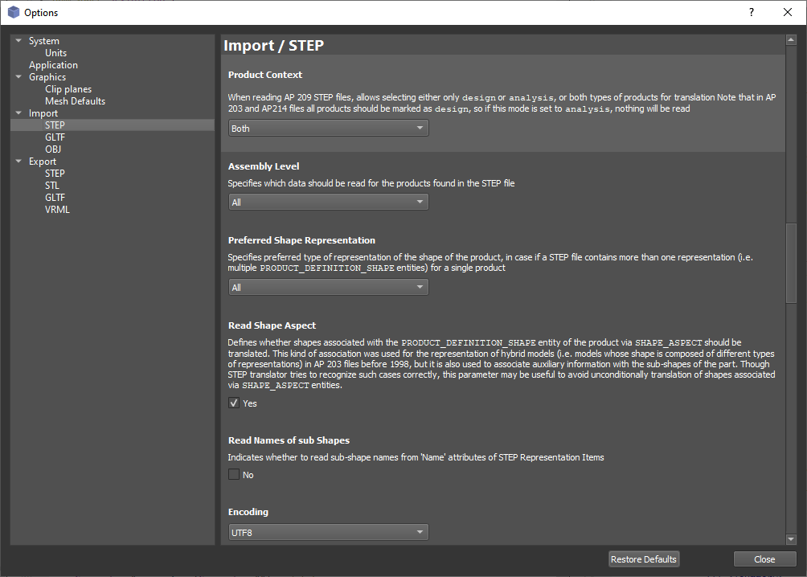
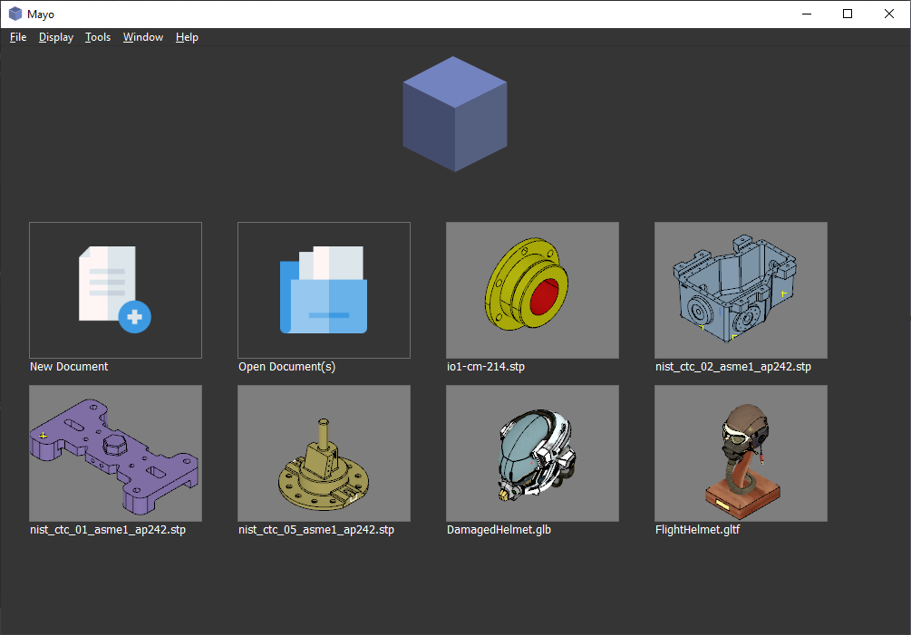

  

# What is Mayo
Mayo is a 3D viewer and converter inspired by FreeCad

# Overview
* View and convert 3D files in different formats
* Explore assembly trees and view properties
* Cross platform: runs on Windows, Linux and macOS
* Underlying toolkits: OpenCascade and Qt

# Current features
* Support of multi-documents, user can open many files in the session
* Support of STEP/IGES assemblies(product structure and colors)
* Area and volume properties for meshes and shapes
* Editable name of STEP/IGES entities
* Editable 3D properties of the imported items, eg. material, color, display mode, ...
* 3D clip planes with configurable capping
* 3D view cube providing intuitive camera manipulation
* Perspective/orthographic 3D view projection
* Save image(snapshot) of the current 3D view
* Quick access to the CAD files recently open thanks to thumbnails in the Home page
* Toggle visibility of any item from the Model tree(use checkbox)

3D viewer operations :
* Rotate : mouse left + move
* Pan : mouse right + move
* Zoom : mouse wheel(scroll)
* Window zoom : mouse wheel + move
* Instant zoom : space bar
* Select Object: mouse left click
* Select Objects: SHIFT + mouse left clicks

# Supported formats
  Formats                 |  Import   |  Export  | Notes
--------------------------|-----------|----------|------------------------------
STEP                      |  &#10004; | &#10004; | AP203, 214, 242(some parts)
IGES                      |  &#10004; | &#10004; | v5.3
OpenCascade BREP          |  &#10004; | &#10004; |
OBJ                       |  &#10004; | &#10060; | Requires OpenCascade &#8805; v7.4.0
glTF                      |  &#10004; | &#10004; | Import requires OpenCascade &#8805; v7.4.0 Export requires OpenCascade &#8805; v7.5.0 Supports 1.0, 2.0 and GLB
VRML                      |  &#10060; | &#10004; | v2.0 UTF8
STL                       |  &#10004; | &#10004; | ASCII/binary
AMF                       |  &#10060; | &#10004; | v1.2 Text/ZIP Requires [gmio](https://github.com/fougue/gmio) &#8805; v0.4.0

# Gallery

# How to build Mayo
Mayo requires Qt5 and OpenCascade &#8805; 7.3.0  
* [Qt installer](https://www.qt.io/download-qt-installer)
* [OpenCascade Download Center](https://old.opencascade.com/content/latest-release)

See detailed [build instructions](https://github.com/fougue/mayo/wiki/Build-instructions-for-Windows-MSVC)
